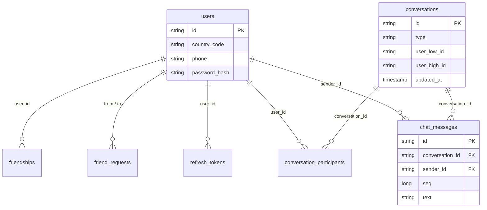

# 数据库表结构与管理

> 版本：v0.1  
> 状态：与当前代码一致  
> 适用范围：Server 开发、运维、Connect / 客户端对齐字段含义

---

## 1. 概述

### 1.1 存储方式（当前）

| 项 | 开发环境（当前） |
|----|------------------|
| 引擎 | H2 Database（文件模式） |
| JDBC | `jdbc:h2:file:./data/ayuchat` |
| 数据文件 | `server/data/ayuchat.mv.db`（启动后生成） |
| 建表方式 | JPA `ddl-auto: update`（启动时按实体自动增列/建表） |
| 控制台 | `http://localhost:8080/h2-console` |

生产环境建议换 **PostgreSQL / MySQL**，并使用 **Flyway 或 Liquibase** 管理迁移脚本（见 [§6](#6-表结构变更流程)）。

### 1.2 文档与代码的关系

| 层级 | 权威来源 | 说明 |
|------|----------|------|
| **表结构说明** | 本文 + `domain/*.java` | 本文面向阅读与 review；实体类是运行时真相 |
| **REST 契约** | `auth_api.md` / `chat_api.md` | 对外 JSON 字段，与 DTO 一致 |
| **产品行为** | `auth_prd.md` / `chat_prd.md` | 业务流程，不直接描述列类型 |

**约定：改表或改接口时，同一 PR 内同步更新本文与对应 API 文档。**

---

## 2. 表总览

共 **9 张表**，分三组：

```
用户与鉴权          好友              聊天
─────────────      ─────────────     ──────────────────────────
users              friend_requests   conversations
sms_codes          friendships       conversation_participants
verify_tokens                        chat_messages
refresh_tokens
```

### 2.1 ER 关系（核心）



---

## 3. 表结构明细

字段类型以 H2 / JPA 映射为准；`Instant` 存为时间戳。

### 3.1 `users` — 用户

| 列名 | 类型 | 约束 | 说明 |
|------|------|------|------|
| `id` | VARCHAR (UUID) | PK | 用户 ID |
| `country_code` | VARCHAR(8) | NOT NULL | 国家码，v1 固定 `+86` |
| `phone` | VARCHAR(20) | NOT NULL | 手机号 |
| `password_hash` | VARCHAR(100) | NOT NULL | BCrypt 哈希 |
| `name` | VARCHAR(32) | NULL | 用户昵称；空则对外展示掩码手机号 |
| `disabled` | BOOLEAN | NOT NULL, default false | 账号禁用 |
| `created_at` | TIMESTAMP | NOT NULL | 注册时间 |

**唯一约束**：`(country_code, phone)`

**实体**：`com.ayuchat.domain.User`

---

### 3.2 `sms_codes` — 短信验证码（临时）

| 列名 | 类型 | 约束 | 说明 |
|------|------|------|------|
| `id` | VARCHAR (UUID) | PK | |
| `country_code` | VARCHAR(8) | NOT NULL | |
| `phone` | VARCHAR(20) | NOT NULL | |
| `scene` | VARCHAR(32) | NOT NULL | `REGISTER` / `RESET_PASSWORD` |
| `code` | VARCHAR(6) | NOT NULL | 验证码 |
| `expires_at` | TIMESTAMP | NOT NULL | 过期时间 |
| `created_at` | TIMESTAMP | NOT NULL | 创建时间 |

**实体**：`com.ayuchat.domain.SmsCode`

---

### 3.3 `verify_tokens` — 短信验证通过后的临时令牌

| 列名 | 类型 | 约束 | 说明 |
|------|------|------|------|
| `id` | VARCHAR (UUID) | PK | |
| `token` | VARCHAR(64) | NOT NULL, UNIQUE | 一次性 verify_token |
| `country_code` | VARCHAR(8) | NOT NULL | |
| `phone` | VARCHAR(20) | NOT NULL | |
| `scene` | VARCHAR(32) | NOT NULL | |
| `expires_at` | TIMESTAMP | NOT NULL | |
| `used` | BOOLEAN | NOT NULL, default false | 是否已使用 |
| `created_at` | TIMESTAMP | NOT NULL | |

**实体**：`com.ayuchat.domain.VerifyToken`

---

### 3.4 `refresh_tokens` — 登录刷新令牌

| 列名 | 类型 | 约束 | 说明 |
|------|------|------|------|
| `id` | VARCHAR (UUID) | PK | |
| `user_id` | VARCHAR(36) | NOT NULL | 关联 `users.id` |
| `token` | VARCHAR(64) | NOT NULL, UNIQUE | refresh_token |
| `expires_at` | TIMESTAMP | NOT NULL | |
| `revoked` | BOOLEAN | NOT NULL, default false | 是否已吊销 |
| `created_at` | TIMESTAMP | NOT NULL | |

**实体**：`com.ayuchat.domain.RefreshToken`

---

### 3.5 `friend_requests` — 好友申请

| 列名 | 类型 | 约束 | 说明 |
|------|------|------|------|
| `id` | VARCHAR (UUID) | PK | 申请 ID |
| `from_user_id` | VARCHAR | NOT NULL | 发起人 `users.id` |
| `to_user_id` | VARCHAR | NOT NULL | 接收人 `users.id` |
| `message` | VARCHAR(100) | | 验证附言 |
| `status` | VARCHAR(16) | NOT NULL | `PENDING` / `ACCEPTED` / `REJECTED` |
| `created_at` | TIMESTAMP | NOT NULL | |

**实体**：`com.ayuchat.domain.FriendRequest`

---

### 3.6 `friendships` — 好友关系

| 列名 | 类型 | 约束 | 说明 |
|------|------|------|------|
| `id` | VARCHAR (UUID) | PK | |
| `user_id` | VARCHAR | NOT NULL | 用户 A |
| `friend_user_id` | VARCHAR | NOT NULL | 好友 B |
| `since` | TIMESTAMP | NOT NULL | 成为好友时间 |

**唯一约束**：`(user_id, friend_user_id)`  
接受好友时写入 **双向两条**（A→B、B→A），便于各自查列表。

**实体**：`com.ayuchat.domain.Friendship`

---

### 3.7 `conversations` — 会话

| 列名 | 类型 | 约束 | 说明 |
|------|------|------|------|
| `id` | VARCHAR (UUID) | PK | 会话 ID |
| `type` | VARCHAR | NOT NULL, default `direct` | v1 仅单聊 |
| `user_low_id` | VARCHAR | NOT NULL | 双方 ID 中字典序较小者 |
| `user_high_id` | VARCHAR | NOT NULL | 双方 ID 中字典序较大者 |
| `updated_at` | TIMESTAMP | NOT NULL | 最后活跃（列表排序） |

**唯一约束**：`(user_low_id, user_high_id)` — 同一对用户只有一个单聊会话。

**不存消息正文**；最后一条消息通过查 `chat_messages` 最大 `seq` 获得。

**实体**：`com.ayuchat.domain.Conversation`

---

### 3.8 `conversation_participants` — 会话成员状态

| 列名 | 类型 | 约束 | 说明 |
|------|------|------|------|
| `id` | VARCHAR (UUID) | PK | |
| `conversation_id` | VARCHAR | NOT NULL | 关联 `conversations.id` |
| `user_id` | VARCHAR | NOT NULL | 关联 `users.id` |
| `unread_count` | INT | NOT NULL, default 0 | 未读条数 |
| `last_read_seq` | BIGINT | NOT NULL, default 0 | 已读到的消息序号 |

**唯一约束**：`(conversation_id, user_id)`  
单聊固定每人一行，共 2 行。

**实体**：`com.ayuchat.domain.ConversationParticipant`

---

### 3.9 `chat_messages` — 聊天消息

| 列名 | 类型 | 约束 | 说明 |
|------|------|------|------|
| `id` | VARCHAR (UUID) | PK | 服务端消息 ID |
| `conversation_id` | VARCHAR | NOT NULL | 所属会话 |
| `sender_id` | VARCHAR | NOT NULL | 发送者 `users.id` |
| `type` | VARCHAR | NOT NULL, default `text` | v1 仅 `text` |
| `text` | VARCHAR(4000) | NOT NULL | 正文 |
| `client_msg_id` | VARCHAR | NOT NULL | 客户端幂等键 |
| `seq` | BIGINT | NOT NULL | 会话内单调递增序号 |
| `created_at` | TIMESTAMP | NOT NULL | 发送时间 |

**唯一约束**：`(conversation_id, client_msg_id)` — 防重复发送。

**建议索引（生产）**：`(conversation_id, seq)` — 按会话拉历史。

**实体**：`com.ayuchat.domain.ChatMessage`

---

## 4. 聊天数据如何组织（消息量大时）

| 问题 | 设计 |
|------|------|
| 消息存在哪？ | 全部在 `chat_messages`，**一行一条消息** |
| 如何按会话隔离？ | `WHERE conversation_id = ? ORDER BY seq` |
| 会话列表预览？ | 查该会话 `seq` 最大的一条，或后续冗余 `last_message_id` |
| 未读数？ | 存在 `conversation_participants`，无需扫消息表 |
| 会不会「一张表很乱」？ | 不会；关系型库就是按行追加，靠 `conversation_id` + 索引分区查询 |

**当前实现注意**：`listMessages` 暂一次返回会话内全部消息，未分页；量大后需按 API 文档实现 `limit` / `before_seq`（见 `chat_api.md` §6.2）。

---

## 5. 与 API / 类型的映射

| API 模型 | 主要来源表 |
|----------|------------|
| `User` / `UserSummary` | `users`（`display_name` 由昵称或掩码手机号生成） |
| `FriendRequest` | `friend_requests` + `users` |
| `Friend` | `friendships` + `users` |
| `Conversation` | `conversations` + `conversation_participants` + `users` + `chat_messages`（last） |
| `Message` | `chat_messages` |

Connect 类型：`connect/src/types.ts`（JSON 字段 `snake_case`）。

---

## 6. 表结构变更流程

### 6.1 何时必须更新文档

| 变更类型 | 需更新的文档 |
|----------|--------------|
| 新增 / 删除 / 改列表 | **本文** + 本文修订记录 |
| 影响 REST 请求/响应 | 对应 `*_api.md` + `connect/src/types.ts` |
| 影响产品行为 | 对应 `*_prd.md` |
| 仅内部实现、对外无变化 | 可只改代码，但建议在 PR 说明中注明 |

### 6.2 推荐 PR 检查清单

```
[ ] domain 实体已修改
[ ] repository / service 已适配
[ ] database_schema.md 表说明已更新
[ ] 相关 API 文档已更新（若有对外影响）
[ ] connect/types.ts 已更新（若有对外影响）
[ ] 修订记录已填写日期与说明
```

### 6.3 开发环境 vs 生产环境

| 环境 | 建表方式 | 说明 |
|------|----------|------|
| 开发（当前） | JPA `ddl-auto: update` | 改实体后重启即尝试 ALTER；**不生成可 review 的 SQL** |
| 生产（建议） | Flyway / Liquibase 迁移脚本 | 版本化 SQL，可审计、可回滚；`ddl-auto` 设为 `validate` 或 `none` |

迁移脚本落地后，应在本文 **§3** 保持与最新迁移一致，或注明「以 `server/src/main/resources/db/migration/` 为准」。

### 6.4 本地查看真实表

1. 启动 `pnpm server:dev`
2. 打开 `http://localhost:8080/h2-console`
3. JDBC URL：`jdbc:h2:file:./data/ayuchat`（工作目录为 `server/`）
4. 用户名 `sa`，密码留空

示例 SQL：

```sql
-- 会话与消息数
SELECT c.id, COUNT(m.id) AS msg_count
FROM conversations c
LEFT JOIN chat_messages m ON m.conversation_id = c.id
GROUP BY c.id;

-- 某会话最近 10 条
SELECT seq, sender_id, text, created_at
FROM chat_messages
WHERE conversation_id = '<会话UUID>'
ORDER BY seq DESC
LIMIT 10;
```

---

## 7. 是否符合业界做法？

**是，这是常见且推荐的做法**，尤其对小团队与产品驱动项目：

| 实践 | AyuChat 现状 | 业界常见做法 |
|------|--------------|--------------|
| **Schema 文档** | 本文 | 内部 Wiki / `docs/database.md` / Notion |
| **API 契约文档** | `auth_api.md`、`chat_api.md` | OpenAPI (Swagger)、API Blueprint |
| **代码即模型** | JPA `@Entity` | 同上 + 迁移脚本为部署真相 |
| **版本化迁移** | 尚未引入 | Flyway / Liquibase（生产必备） |
| **变更与文档同步** | PR 检查清单（本文 §6.2） | Code Review 规则、CI 检查链接 |
| **单一事实来源** | 实体 + 文档双维护（过渡期） | 成熟团队以 **迁移脚本 + OpenAPI 生成** 减少手写漂移 |

当前阶段：**手写 schema 文档 + JPA 实体 + API 文档** 完全合理。用户量与协作人数上来后，再补：

1. Flyway 迁移（表结构可审计）
2. OpenAPI 从 Controller 生成或契约优先
3. CI 检查文档链接与必要字段

---

## 8. 修订记录

| 版本 | 日期 | 说明 |
|------|------|------|
| v0.1 | 2026-08-22 | 初稿：9 张表结构、ER、变更流程、与 API 映射 |
